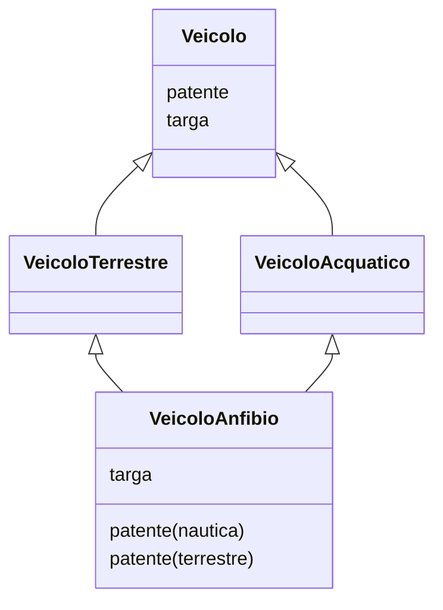

# Conformità
Le classi sono tipi di dati astratti. Le sottoclassi che estendono una classe principale *parent*, oltre ad estendere le funzionalità di *parent*, appartengono logicamente ad un sottoinsieme dell'insieme *parent*. Quindi è legittimo assegnare a oggetti appartenenti alla classe *parent* oggetti delle sue sottoclassi.

## Knowledge Links
[[13_oop_basics]] [[11_modificatori]] [[6_opertori_e_costrutti]] [[5_variabili]] [[3_oop_concetti]]

## Regola di conformità
> Ad una variabile di tipo C è possibile assegnare un oggetto di tipo CI, se CI è sottotipo di C.

```java
Contatore c = new Contatore();
ContatoreEsteso ce = new ContatoreEsteso();
ce.ext(); // Ok
c.ext();  // Non esiste
c = ce;  // Ok perchè ce specializza c
ce = c;  // Non consentito
c.ext();  // Non funziona perchè il compilatore controlla il tipo di c
```

## Studente-persona
```java
public class Studente extends Persona {
	private int matricola;
	public Studente() {
		super();
		this.matricola = 0;
	}
	public Studente(String n) {
		super(n);
		this.matricola = 0;
	}
	public Studente(String n, int m) {
		super(n);
		matricola = m;
	}
}

// Posso fare
Persona p = new Studente();  // Dalla regola di conformità

// Ma non
Studente s = new Persona();
```

## Polimorfismo
>Letteralmente: manifestarsi sotto forme diverse

### Esempio
```java
Veicolo V;
Topolino A1 = new Topolino(4);  // Dove Topolino estende Veicolo
SeicentoFamiliare A2 = new SeicentoFamiliare();  // SeicentoFamiliare estende Veicolo

V = A1;
System.out.println(A1);  // Stampa "Sono una Topolino a 4 posti" perchè è stato fatto l'override del metodo toString

V = A2;
System.out.println(A2); // Stampa "Sono una Seicento Familiare"
```

Attenzione: Il controllo di tipo viene fatto dal compilatore, quindi nell'esempio precedente non avrei potuto chiamare un metodo che non era stato definito nella classe `Veicolo`.

Il metodo da chiamare viene scelto a tempo di esecuzione.

## Ingredienti del Polimorfismo
- **Binding dinamico**: associazione dinamica tra variabile e oggetto (V e oggetto A1, A2)
- **Operation Dispatching dinamico**: ricerca dei metodi a tempo di esecuzione (vedi VTable)
- **Overriding**: sovrascrittura metodi ereditati in modo da specializzare il comportamento di un metodo in una sottoclasse (overriding != polimorfismo)
- **Regola di conformità**: possibilità di assegnare ad una variabile di una certa classe, una qualsiasi variabile di classe discendente

## Vantaggi
Potremmo ottenere un risultato simile con un costrutto switch-case:
```C
switch (typeof(V)) {
	case Topolino:
		printf("Sono una Topolino")
		break;
	case Seicento:
		printf("Sono una Seicento")
		break;
}
```

Gli svantaggi con questo metodo sono i seguenti:
- se aggiungo un altro tipo che specializza V devo anche aggiungere un case
- questo controllo deve essere implementato dall'utilizzatore

**Semparazione controllo da comportamento**: il controllo viene gestito da chi chiama i metodi polimorfici, il comportamento è definito dal metodo polimorfico

# Classi Astratte
Servono per definire che un oggetto offrirà un servizio, senza definirlo; definisce il **comportamento** di una classe, ma non la sua implementazione.

Le classi astratte **fattorizzano** il comportamento di sottoclassi (= delegare la definizione del servizio alle classi **concrete**).

Esempi di classi astratte possono essere:
- Veicolo
- Animale
- Elettrodomestico

Veicolo può essere concretizzato da:
- Automobile
- Camion
- Monopattino
- Bici
- Aereo
- Barca
- Etc.

Nella programmazione ad oggetti le **classi astratte** servono a definire un comportamento comune ad altre classi, senza definirne concretamente il comportamento. Possono mantenere uno stato interno.

## Sintassi
Si usa la parola chiave **abstract**.

```java
public abstract class Veicolo {
	private String nome;
	private int cilindrata;
	private String targa;
	
	public abstract String trasporta();
	public String toString() {
		return nome + " traporta: " + trasporta();  // chiamo il metodo trasporta() implementato dalla classe concreta. Così facendo poso dichiarare toString senza conoscere l'implementazione del Veicolo
	}
}
```

Posso avere una classe astratta senza metodi astratta -> verranno ridefiniti dalla sottoclasse cha la implementa.

Basta avere un metodo astratto per rendere l'intera classe astratta.

Una **classe concreta** deve implementare tutti i metodi astratti che eredita dalla classe astratta, altrimenti non può essere considerata tale.

I **costruttori** nelle classi astratte sono utili per inizializzare lo stato della classe astratta. Non servono per creare istanze; solitamente viene definito **protected** perchè non è legale invocarlo dall'esterno, ma può essere comunque chiamato da una classe figlia.

Attenzione: se nella classe astratta vengono chiamati metodi astratti, essi saranno cercati "a partire dal basso", quindi (dato che l'oggetto istanziato è sicuramente concreto) verranno anche trovati

## Esempio Veicoli
Vogliamo rappresentare una serie di veicoli, distinti da due criteri diversi:
1. oggetto del trasporto
2. ambiente dove possono viaggiare

Ho quindi 4 possibili combinazioni, con interesezioni che non posso rappresentare con la sola ereditarietà; in questo caso devo scegliere uno dei due criteri, con lo svantaggio che duplico le entità che vengono distinte con l'altro criterio:
| Criterio          | Veicolo Terrestre     | Veicolo Acquatico     |
| ----------------- | --------------------- | --------------------- |
| Trasporto Persone | Terrestre con persone | Acquatico con persone |
| Trasporto Merci   | Terrestre con merci   | Acquatico con merci   |

Posso risolvere il problema con l'ereditarietà multipla, che conferisce maggiore espressività al linguaggio. Non presente in Java. -> ha lo svantaggio che posso avere variabili e metodi omonimi nella stessa classe figlio.



Java sopperisce a questa mancanza con le interfacce.

# Interfacce
Insieme di dichiarazione di metodi non implementati (non serve usare `abstract`):

```java
public interface VeicoloPersone {
	public void viaggia();
}
```

Tra le interfacce è consentita l'ereditarietà multipla, purchè non ci siano conflitti. Una classe può implementare zero o più interfacce.

```java
public interface VeicoloAnfibio extends VeicoloTerrestre, VeicoloAcquatico {
	...
}
```

Tra classe e interfaccia uso `implements`, mentre tra due interfacce devo usare `extends`.

Alcune interfacce come `Serializable` o `Clonable` servono solo come marcatori. Esse non definiscono metodi.

## Consigli progettuali
Interfacce -> comportamento
Classi -> implementazione

Con l'utilizzo delle interfacce perdo i vantaggi dei metodi concreti che invece avevo con le classi astratte.

### Esempio: reali e complessi
I numeri reali sono concettualmente contenuti nell'insieme dei complessi, con parte immaginaria pari a zero. Ma dal punto di vista progettuale è inefficiente mantenere la parte immaginaria a zero.
Uso le interfacce per mantenere l'aspetto concettuale valido.
