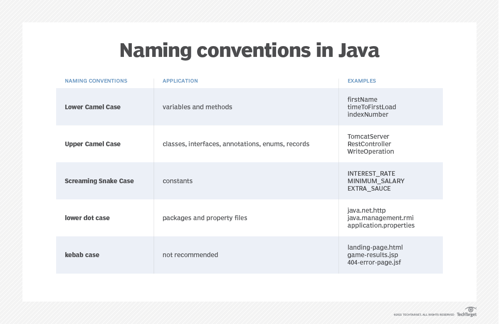

# Operatori e costrutti del linguaggio Java

## Operatori aritmetici
- soliti
- %
- ++
- \-\-

## Operatori logici
`&&`, `||`, `!` che funzionano in cortocircuito logico

## Bitwise operators
`|` e `&` operano sui singoli bit

`<< n` e `>> n` moltiplicano o dividono per 2^n

## Confronti
Ogni confronto produce un valore booleano, a differenza del C che accetta interi (uguali o diversi da 0).

Quindi il confronto `if (a=0.5)`, che eseguirebbe un assegnamento, produce un errore.

Le condizioni in Java devono sempre produrre un valore booleano

## Blocchi di istruizoni
Ogni blocco viene visto come una sola istruzione logica (composta da più istruzioni concatenate tra loro)

## Costrutti iterativi
`for (assegnamento; condizione di permanenza; modifica variabile)`

È legale: `for (int i=0; i<10; i++) {}` che permette di limitare lo scope di i al ciclo for

Esistono anche `while(cond) {}` e `do {} while(cond)` come in C

## Funzioni
Le funzioni (metodi, in quanto possono essere definiti solamente all'interno del corpo di una classe) hanno la stessa sintassi del C: `ret_type name(type1 arg1, type2 arg2, ...)`

Possono esistere metodi con lo stesso nome ma con numero e tipo di parametri differenti. Non posso avere più metodi con stesso nome e stessi parametri ma con tipo di ritorno differente.

## Commenti
- Stile C: `/* multiline comment */`
- Stile C++: `// inline comment`
- Stile Javadoc: `/** docs */`

## Classe
La keyword `class` permette di definire una classe: stato + interfaccia.

Per dichiarare una variabile appartenente ad una classe si usa il costrutto `new`.

Variabile != oggetto &larr; la variabile mantiene il riferimento, l'oggetto contiene i dati effettivi

### Classi Wrapper
Wrappano i tipi primitivi, rendendoli oggetti: _Byte_, _Short_, _Integer_

Da Java 5 l'autoboxing permette di convertire tipo primitivo in wrapper a compile-time

### Costruttore
Metodo speciale chiamato automaticamente quando si crea un nuovo oggetto.

Caratteristiche:
- stesso nome della classe
- no valore ritorno (neanche `void`)
- overload ammesso

Il costruttore implicito (costruttore di default) non prende parametri e non esegue istruzioni.

Java, come il C, è case-sensitive. Naming convention: *camelCase*



## Creazione oggetto
La variabile viene memorizzata nello stack, l'oggetto nell'heap.
```java
Contatore cont = new Contatore();
```

Se un oggetto non è referenziato interviene il garbage collector.

Il codice eseguibile non viene mischiato ai dati (quindi il codice dei metodi non si trova nella memoria allocata per l'oggetto)
